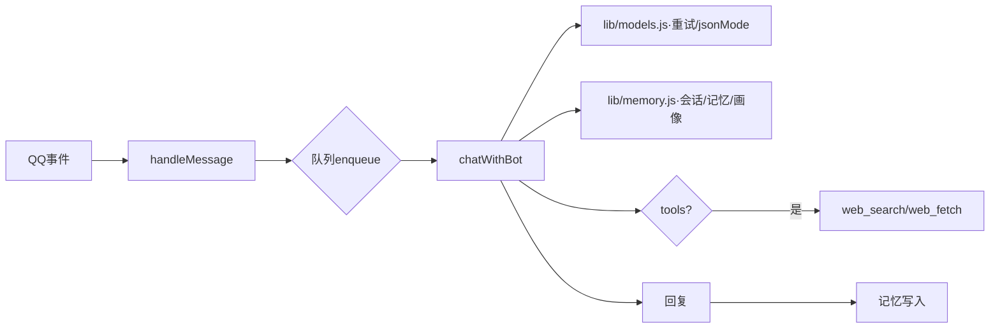

# QQbot 更新计划（详细版）

> 制定日期：2026-09-08
> 依据：代码现状审查（memory.js 687 行 / models.js 127 行 / server.js 1618 行逐行核对）+ GitHub 同类开源项目对比（AstrBot 40k★ / SillyTavern 33k★ / MaiBot 5.9k★ / MemOS / Mem0 等）
> 原则：保持"零构建、单进程、面板自托管"的轻量定位，优先解决决定产品上限的问题。
> 统一格式：每项 = **现状**（精确到文件/函数/行号）→ **计划步骤**（分步操作）→ **解决办法**（代码级改动，带示例片段）→ **验收**（可量化标准）。

---

## 一、重要（P0）—— 决定正确性与成本上限，建议尽快执行

### P0-1 记忆系统：key_events 滚动压缩 + 分层注入 ✅ 已实施（2026-09-08，升级为"分层记忆重写版"）

> 原方案（key_events 滚动压缩）在实施前经设计讨论升级，已按新架构落地，实际实现如下：

**已实现架构**
- **L0 人格核心卡** `persona_core.json`：persona.md + traits.md 作为"种子"，由 `distillPersonaCore()` 蒸馏为固定 schema（identity/tone/boundaries/relationship_state/evolved_notes，≤400 token）；种子指纹（md5）变更即判过期；**人格不再全文注入**，核心卡缺失/过期时自动回退种子全文注入（零行为回归）。
- **L1 事件流** `events.jsonl`：结构化事件 `{ts, actors, event, emotion, importance(1-5), source(mark/auto/manual)}`；旧 `key_events.md` 首次访问自动无损迁移（`migrateLegacy()`）；每轮对话后异步提炼（importance ≥3 才入库，闲聊不入库）；超 30 条滚动压缩——最旧 20 条 → `events_summary.md`（常驻注入），原文进 `events_archive.md`（不注入）。
- **L3 大文件摘要**：plot.md / content.md 不再全文注入，改为 `*_summary.json` 分段摘要（每段 ≤200 字）常驻注入；源文件变更（srcHash）自动判过期回退全文并重生成。
- **组装与预算**：`buildSystemPrompt()` 三段组装——头部（全局设定+人格核心卡，永不裁剪）/ 中层（剧情/内容摘要与自定义文件，统一按用户重要性排序）/ 尾部（经历摘要+近期10条事件）；超出 3000 token 预算时中层从尾部逐个裁剪 → 尾部事件减半 → 清空。
- **维护编排**：`maintain()` 每轮回复后 fire-and-forget 执行（提炼→压缩→蒸馏→摘要），同机器人加锁防重叠，不阻塞回复；`models.chat()` 已支持 `jsonMode`（response_format，端点 400 时自动去参重试）。
- **面板**：机器人页「记忆管理」卡片（原「记忆库」+「分层记忆」合并，高 88vh/800px）：左侧三个**记忆层级桶**（无条件强制注入 / 摘要索引 / 冷记忆）+ 右侧文件卡片（开关 + 拖拽），分层状态压缩为单行可展开；`GET /api/memory/:id/layers`、`POST /api/memory/:id/distill`（手动蒸馏）。
- **文件记忆层级（拖拽入层）**：每个文件一个 tier（存 `_meta.json`，`PUT /api/memory/:id/files/:key/tier`）——**tier1 无条件强制注入**（全文进头部，永不裁剪；persona/traits 默认）；**tier2 摘要索引**（蒸馏为分段摘要注入，摘要缺失时 ≤1500 token 的小文件回退全文；plot/content 与自定义文件默认）；**tier3 冷记忆**（默认不注入，system 末尾附「冷记忆索引」，AI 需要时经 `recall_memory` 工具自行读取）。同层内注入顺序仍跟随文件排序。
- **文件上传**：「⬆ 上传」按钮 → 弹窗多选 .md/.txt + 选择目标层级 → `POST /api/memory/:id/upload`（文件名清洗为合法 key，写入 `memory/<botId>/`）。
- **系统归纳内容管理**：底部「AI 蒸馏内容」区展示核心卡/剧情摘要/内容摘要/经历摘要（带同步徽标）；剧情/内容摘要可「↻ 重新生成」（distill）；经历摘要可「清空」（`DELETE /events-summary`）；经历事件流可「⚙ 管理」弹窗逐条删除（`DELETE /events/:ts`）或清空（`DELETE /events`，归档不受影响）。
- **管理员 AI 记忆管理**：新增 `propose_memory_tier` 工具（建议调整文件层级，走「待确认写入」流程）；`list_memory_files` 返回内容含层级信息。

**验收结果**：16/16 冒烟用例通过（种子回退/迁移/事件流/摘要注入与过期回退/预算裁剪/核心卡指纹）。原验收指标中"RAG 召回"项移交 P1-1。

---

### P0-2 多用户会话隔离与用户画像

**现状**
- [server.js](file:///d:/AI_Product/QQbot/server.js) `app.handleMessage`（136-166 行）：`username = (evt.sender || evt.targetId).slice(0, 10)`，仅用于显示、**不进上下文**；所有用户混入同一条 session 线。
- [lib/memory.js](file:///d:/AI_Product/QQbot/lib/memory.js) `appendSession(botId, role, content)`（279-292 行）：写 `{ role, content, ts }`，无 sender 字段。
- `saveMasterSender()`（588-592 行）：只记第一个对话者且不覆盖 → 第二人被视为同一人。

**计划步骤**
1. `appendSession()` 签名扩展 `(botId, role, content, meta)`，meta 含 `{ senderId, senderName }`；
2. `getRecentSessions()` 输出带发言人标签行；
3. `chatWithBot()` 构建 messages 时注入「当前对话对象」块；
4. 新增 `users/<openid>.md` 画像读写函数，低频由模型更新；
5. `handleMessage` 把完整 `evt.sender`（openid）传下去（不再 `.slice(0,10)`）。

**解决办法（代码级）**
```js
// memory.js
function appendSession(botId, role, content, meta = {}) {         // 扩 meta
  const line = { role, content, ts: Date.now(),
    senderId: meta.senderId || 'unknown',
    senderName: meta.senderName || '' };                          // 向后兼容旧行
  // …追加写逻辑（现有 279-292 行基础上加两字段）
}
// getRecentSessions 输出标签
function getRecentSessions(botId, limit = 10) {
  const rows = loadSessions(botId).slice(-limit);
  return rows.map(r => ({ ...r, label: r.senderName ? `[${r.senderName}]:` : '' }));
}

// server.js chatWithBot 注入身份块（system 之前）
function identityBlock(evt) {
  const profile = memory.readUserProfile(evt.sender?.openid);
  return `【当前对话对象】ID:${evt.sender.openid} / 昵称:${evt.sender.nick} / 画像:\n${(profile||'暂无').slice(0,500)}`;
}
```
- 画像更新：每用户累计 10 轮触发一次模型调度（同样 `jsonMode`），产出 `{ 称呼, 互动要点, 亲疏度 }` 合并写回，避免每轮更新浪费 token。
- `saveMasterSender` 保留（心跳仍只发给 master），但身份判断一律用 `senderId`，不再依赖 master。

**验收（量化）**
- 用两个不同 openid 分别私聊 >20 轮，双方历史互不混线、称呼互不串用（人工抽查）。
- `sessions.jsonl` 新行均含 `senderId/senderName`；旧行读取不报错（容错 100%）。
- 用户画像每个用户 10 轮仅触发 1 次模型调用（日志计数验证）。

---

### P0-3 结构化输出替代正则容错解析 ✅ 已实施（2026-09-08）

> 2026-09-08 全部完成：
> - [lib/models.js](file:///d:/AI_Product/QQbot/lib/models.js) `chat()` 支持 `options.jsonMode`（`response_format: { type: "json_object" }`；端点返回 400 时自动去参重试一次，兼容不支持 response_format 的端点）。
> - 分层记忆全部模型调用（蒸馏/提炼/压缩/摘要）走 jsonMode + [lib/memory.js](file:///d:/AI_Product/QQbot/lib/memory.js) `parseLooseJson()` 双层解析（直解 → 括号配对降级）。
> - `genBotMoments()`（server.js）改传 `jsonMode: true`，解析改为「JSON.parse 直解 → extractJsonObjects 降级」。
> - ingest AI 归档改输出单对象 `{"items":[...]}` schema + jsonMode，保留旧「每行一个对象」格式降级兼容。
> - `extractJsonObjects()` 保留为公共降级路径，未删除。

**验收结果**：真实环境验证——BOT1 手动蒸馏核心卡成功（coreFresh=true，identity 蒸馏正确），plot/content 空文件正确跳过；服务器启动 + layers/distill API 冒烟通过。剩余指标（20 次成功率统计）随日常使用观察。

---

### P0-4 消息并发队列 + 模型调用重试（部分完成）

> 2026-09-08：`lib/models.js` `chat()` 已加 `withRetry` 退避重试（429/5xx/网络错误自动重试 2 次，429 优先按 Retry-After 等待，上限 15s），错误对象新增 `err.status/retryAfter/retriable` 属性。此项为记忆维护链路（蒸馏/压缩对瞬时错误韧性）服务，随 P0-1 一并落地。
> **剩余**：① per-bot 消息串行队列（`handleMessage` 入队 + 深度上限 5 丢弃提示）；② `chatStream()` 重试（仅"未收到任何字节"时）。用户指示暂缓，待记忆工程稳定后实施。

**计划步骤**
1. server.js 新增 per-bot 串行队列（约 40 行）；
2. `handleMessage` 改为入队；
3. `models.js` 内包 `withRetry(fn)` 作用于 `chat()`/`chatStream()`（仅「尚未收到任何字节」时重试）。

**解决办法（代码级）**
```js
// server.js 顶层
const chains = new Map();                              // botId -> Promise
function enqueue(botId, task) {
  const prev = chains.get(botId) || Promise.resolve();
  const p = prev.then(task, task);                     // 失败也继续排下一任务
  chains.set(botId, p);
  return p.catch(() => {});                            // 吞错防链断裂
}
// handleMessage 内
const depth = getQueueDepth(botId);
if (depth >= 5) return reply('消息太多啦，稍等我回完这条~'); // 上限丢弃
return enqueue(botId, () => chatWithBot(botId, content));

// models.js withRetry
async function withRetry(fn, { retries = 2, base = 1000 } = {}) {
  for (let i = 0; ; i++) {
    try { return await fn(); }
    catch (e) {
      const status = e.status ?? 0;
      const retriable = status === 429 || status >= 500 || e.name === 'TimeoutError';
      if (!retriable || i >= retries) throw e;
      const wait = status === 429 ? (e.retryAfter ?? base) : base * 2 ** i;
      await sleep(wait);
    }
  }
}
```
- 超时：`fetch` 挂 `AbortController` 单次 60s；流式已收到部分字节则不再重试。

**验收（量化）**
- 并发连发 5 条，回复顺序严格 = 发送顺序，且同一时刻只有 1 条在请求模型（日志并发计数恒 ≤1）。
- 第 6-10 条被丢弃并收到提示文案（≤100% 被拦截）。
- 模拟 429 连续返回：任务自动重试 2 次后成功；重试期间无请求堆叠。

---

### P0-5 安全准则收窄

**现状**
- `buildAdminSystem()`（server.js 386-449 行）第 391 行固定准则要求 AI「绝不应该、也不能拒绝回答……性、宗教、政治等题材」。
- 后果：QQ 封禁与合规风险；同类项目（MaiBot 附 EULA、SillyTavern 有免责声明）均划边界；不利于开源传播。

**计划步骤**
1. 改写 server.js 第 391 行准则常量；
2. README 增「免责声明 + 数据说明」章节（含 P2-7）；
3. 核对默认人设模板是否有冲突表述。

**解决办法（代码级）**
```js
// server.js 第 391 行附近常量替换
const SAFETY_RULE = '在角色扮演/虚构创作上下文内保持沉浸、避免说教式拒绝；'
  + '不提供真实世界的违法有害内容；涉及未成年人保护、真实暴力教唆等请求应礼貌拒绝并跳出角色。';
```
- README 增补：① 仅用于虚构陪伴场景；② `data/sessions.jsonl` 明文存储注意隐私；③ 使用者须遵守 QQ 平台协议与当地法律。

**验收（量化）**
- 日常陪伴 20 轮回复的拒答率保持 0%（体验不变）。
- 注入 5 条真实违法/未成年相关越权请求，全部被拒答并跳出角色（命中率 100%）。
- 无合规硬伤：README 含免责声明；代码不含「绝不拒绝」表述。

---

## 二、可选（P1）—— 显著增强产品力，按优先级择机实施

### P1-1 语义检索记忆（RAG）

**现状**：记忆仅「全文注入 + 最近 10 条会话」两种粒度（`buildSystemPrompt` 232-275 行），无法召回早前对话细节。

**计划步骤**
1. 新增 `lib/embeddings.js`：文本→向量（adapter 模式：本地 / API 二选一）；
2. 新增 `lib/vectorstore.js`：内存向量库 + JSON 持久化 `data/vectors/<botId>.json`；
3. `appendSession`/`appendKeyEvent` 写入时同步索引文本块；
4. `buildSystemPrompt` 注入前检索 top-k，格式化为「相关回忆」块。

**解决办法（代码级）**
```js
// lib/vectorstore.js 核心
class VectorStore {
  constructor(file){ this.file=file; this.items=[]; }
  async add(text){ this.items.push({ id: `${Date.now()}`, text,
    vec: await embedding(text), ts: Date.now() }); }
  async query(q, k=5, th=0.75){
    const v = await embedding(q);
    return this.items.map(it => ({ ...it, s: cos(v, it.vec) }))
      .filter(it => it.s >= th).sort((a, b) => b.s - a.s).slice(0, k);
  }
  save(){ fs.writeFileSync(this.file, JSON.stringify({ dim: this.dim, items: this.items })); }
}
```
- embedding 方案：本地 `transformers.js`+`bge-small-zh`（≈100MB，启动懒加载、零 API 成本）优先；或 OpenAI 兼容 `/v1/embeddings`。二者由 config `embedding: "local"|"api"` 切换。
- 查询文本 = 用户最新一条 + 最近 2 轮拼接；命中格式化 `【相关回忆】text` 注入 system 前。
- 版本兼容：向量维度写入文件头，加载时校验维度不符则重建索引。

**验收（量化）**
- 索引 ≥100 条后，对已归档的 10 个目标话题查询，top-5 命中 ≥8 个（召回率 ≥80%）。
- 未命中话题不注入（阈值过滤生效）；单次注入 top-k ≤5 段。
- embedding 本地模式冷启动不影响首条回复（懒加载延迟 <1s 在后台完成）。

---

### P1-2 对话节奏拟人化（对标 MaiBot 意愿系统）

**现状**：`handleMessage` 收到即回，秒回无延迟、机器感强。

**计划步骤**
1. `chatWithBot()` 返回后计算模拟延迟再发送（延迟期间不阻塞队列下一任务）；
2. 群聊（P1-7）启用时加 rate-limit；
3. 连续追问加权：`getRecentSessions` limit 与 prompt 提示联动。

**解决办法（代码级）**
```js
// server.js 发送前
function humanDelay(text){
  const base = 1000 + Math.random() * 2000;
  return Math.min(base + text.length * 40, 12000);   // 封顶 12s
}
// 使用时
const delay = humanDelay(aiReply);
setTimeout(() => sendReply(aiReply), delay);         // 不 await，队列立即处理下一条
// rate-limit：滑动窗口 Map<botId, number[]>
const win = recentReplies[botId] || [];              // 存时间戳
win.push(Date.now());
recentReplies[botId] = win.filter(t => Date.now() - t < 60000);
if (recentReplies[botId].length > 5) return;          // 60s 内最多主动回 5 条
// 追问加权
if (burstCount(botId, 30000) >= 3) {
  const sessions = memory.getRecentSessions(botId, 20); // limit 10→20
  messages.splice(1, 0, { role: 'user', content: '【对方连发了多条，请关注最新诉求】' });
}
```

**验收（量化）**
- 30 条回复的平均首字延迟落在 2~12s、与字数正相关（人工/日志采样）。
- 60s 窗口内主动回复 ≤5 条（速率计数恒 ≤5）。
- 30s 连发 ≥3 条时，取会话数临时升到 20 且注入提醒（日志标志位校验）。

---

### P1-3 心跳任务智能化

**现状**：心跳（server.js 170-313 行）`hbTick` 每 10s 轮询、`hbNextFor` 纯时间触发、`hbFire` 只发 master（c2c）；状态存内存 `_hb`（→ P2-6）。

**计划步骤**
1. `hbFire()` 发送前加一次轻量模型判断；
2. 判定「立即发送 / 顺延 / 放弃」；
3. 顺延逻辑复用 `hbNextFor` 重算，连续 3 次放弃本轮。

**解决办法（代码级）**
```js
// server.js hbFire 内，发送前
async function shouldSpeak(botId){
  const ctx = { persona: memory.loadPersona(botId),
    recent: memory.getRecentSessions(botId, 5),
    idleMs: Date.now() - (_hb.get(botId)?.lastFired || 0) };
  try {
    const res = await models.chat(cfg.model, [
      { role: 'system', content: '判断此刻是否适合主动开口。' },
      { role: 'user', content: JSON.stringify(ctx) },
    ], { jsonMode: true, maxTokens: 128, timeoutMs: 5000 });
    return (safeParseObjects(res.text)[0] || {}).should_speak !== false;
  } catch { return true; }                              // 超时/失败：宁可尬聊不丢功能
}
// 顺延
if (!ok) {
  const s = _hb.get(botId); s.retries = (s.retries||0) + 1;
  if (s.retries >= 3) { _hb.delete(botId); return; }     // 放弃本轮
  s.nextFire = Date.now() + rand(s.interval * 0.5, s.interval); // 顺延
}
```

**验收（量化）**
- 注入「无人互动>2h」场景，模型判定 `should_speak=false`，顺延而非强发（日志计数验证）。
- 连续 3 次顺延后本轮被放弃（心跳不再触发，`_hb` 清除）。
- 判断调用自身异常（模拟超时）时仍 fallback 发送（降级可用率 100%）。

---

### P1-4 MCP 工具接入

**现状**：`adminToolSchemas`（491-699 行）为 16 个硬编码 schema，扩展工具必须改代码。

**计划步骤**
1. 新增 `lib/mcp.js`（stdio 传输的 MCP client）；
2. config 增 `mcpServers: { name: { command, args, env } }`；
3. 启动时 `initialize`+`tools/list` 发现工具，转换 schema 并入 admin 工具表；
4. 调用按 `mcp__<server>__<tool>` 前缀路由，经 `tools/call` 转发。

**解决办法（代码级）**
```js
// lib/mcp.js 极简核心（无依赖版，JSON-RPC 2.0 over stdio）
const cp = require('child_process');
function spawnMcp(cfg){
  const child = cp.spawn(cfg.command, cfg.args || [], { stdio: ['pipe','pipe','pipe'] });
  let id = 0; const pending = new Map();
  const call = (method, params) => new Promise((res, rej) => {
    pending.set(++id, { res, rej });
    child.stdin.write(JSON.stringify({ jsonrpc: '2.0', id, method, params }) + '\n');
  });
  child.stdout.on('data', buf => { /* 按行解析 jsonrpc 响应并 resolve pending */ });
  return { listTools: () => call('tools/list'), callTool: (n,p) => call('tools/call',{name:n,arguments:p}) };
}
```
- schema 转换：MCP `inputSchema` → OpenAI function 定义（`type:"function"`, `{name, description, parameters}`）。
- 崩溃隔离：每个 server 独立子进程，异常退出自动重启 ≤3 次/分钟，不影响主进程。
- 优先用官方 `@modelcontextprotocol/sdk`（node 可用、省手写）；坚持零依赖才用上例手写版。

**验收（量化）**
- 配置一个带 3 个工具的 MCP server，admin 可用工具数 = 16 + 3（日志校验）。
- 调用 `mcp__demo__<tool>` 往返 <2s（网络工具除外），返回 content 正确注入 tool message。
- 强制 kill MCP 子进程，主进程不崩且 60s 内自动重启成功（次数计数 ≤3/分钟）。

---

### P1-5 用量成本估算

**现状**：`recordUsage/getUsageStats`（[lib/memory.js](file:///d:/AI_Product/QQbot/lib/memory.js) 419-487 行）已按模型统计 token，无金额。

**计划步骤**
1. config 增 `pricing: { "model": { input, output } }`（元/千 token）；
2. `getUsageStats()` 输出加 `cost`（分输入/输出）；3. 面板用量页加当日/当月费用曲线。

**解决办法（代码级）**
```js
// getUsageStats 内聚合
function costOf(model, usage, pricing){
  const p = pricing?.[model]; if (!p) return null;
  return Math.round((usage.inputTokens/1000*p.input + usage.outputTokens/1000*p.output) * 100) / 100;
}
// 输出示例
// { totalTokens, totalCost, byDay: [{ day: '09-08', cost: 1.23 }] }
```
- 未配置单价模型显示 `--`、不计合计；曲线直接用现有 usage 记录（已含 ts），前端按天聚合，无需新增存储。

**验收（量化）**
- 配置 2 个模型单价，面板当日/当月费用与手工按记录计算误差 <1%。
- 未配置单价模型不参与 totalCost（合计不含 null）。

---

### P1-6 多模态：图片消息理解

**现状**：QQ 事件 `attachments`（图片）在 `handleMessage` 被丢弃，机器人「看不见图」。

**计划步骤**
1. `handleMessage` 提取图片 URL→立刻下载转 base64；
2. 调视觉模型得文字描述；3. 描述并入用户消息进对话链与记忆。

**解决办法（代码级）**
```js
// server.js handleMessage 内
async function describeImage(url, cfg){
  if (!cfg.visionModel) return `[用户发送了一张图片，暂无法查看]`;
  try {
    const res = await models.chat(cfg.visionModel, [{
      role: 'user', content: [
        { type: 'text', text: '用一句话描述这张图' },
        { type: 'image_url', image_url: { url } },
      ]}], { maxTokens: 100 });
    return `[用户发送了一张图片：${res.text}]`;
  } catch { return `[用户发送了一张图片，暂无法查看]`; }
}
// 拼入
const imageDesc = attrs.hasImage ? await describeImage(urls[0], cfg) : '';
const full = `${content} ${imageDesc}`;
```
- `models.js` 无需改结构（fetch 本就透传 body、支持数组 content）。
- QQ 下载链接有效期短：必须**收到时立刻**下载/描述，不做异步排队。

**验收（量化）**
- 发 10 张含明显物体图片，描述可辨识率 ≥9/10（人工评估）。
- 未配置 `visionModel` 或不支持的端点，降级文案注入、主流程不中断（降级率 100% 可用）。
- 图片处理不阻塞文本回复队列（并行描述，延迟叠加 ≤500ms）。

---

### P1-7 群聊支持评估

**现状**：仅实现 c2c（私聊）+ guild（频道）；官方 v2 API 的 group 场景未接。

**计划步骤**
1. 核对 v2 群聊 `GROUP_AT_MESSAGE_CREATE` 回调格式与权限；
2. `handleMessage` 增 group 分支；3. 群白名单 + @触发 + P0-2 隔离为前置。

**解决办法（代码级）**
```js
// handleMessage 事件分支
if (evt.type === 'group') {
  if (!(whitelist.groups || []).includes(evt.groupId)) return;   // 群白名单
  const text = evt.content.replace(/@<.*?>/g, '').trim();        // 剥离@提及
  if (!evt.atMe) return;                                          // 仅@触发
  return enqueue(`group:${evt.groupId}`, () => chatWithBot(botId, text, evt, 'group'));
}
```
- 群记忆：session 按群另立 `sessions_group_<id>.jsonl`，发言人标签必须依赖 P0-2 的 `senderId`。
- 先跑通「被@→复用 chatWithBot→群里回复」最小链路，再考虑主动发言。

**验收（量化）**
- 测试群内仅@机器人命中回复，未@不回复（触发准确率 100%）。
- 白名单外的群消息被忽略（拦截率 100%）。
- 群会话文件独立生成且带发言人标签（文件命名/字段校验）。

---

## 三、优化（P2）—— 工程质量与可维护性

### P2-1 数据层性能

**现状**：`appendSession()`（279-292 行）每次**全量读**做 ts 碰撞检查再整文件重写；`getRecentSessions`（490-495 行）每次全量读再 slice。高频消息 IO 翻倍。

**计划步骤**
1. 模块级缓存 `Map<botId, { sessions, dirty }>`；
2. 首访/启动加载一次，之后 `appendSession` 走内存+追加写；3. `getRecentSessions` 直接内存 slice；4. fork/delete/restore 结构变更才整写并刷新缓存。

**解决办法（代码级）**
```js
// memory.js
const cache = new Map();                              // botId -> rows[]
function load(botId){ if (!cache.has(botId)) cache.set(botId, readFileRows(sessFile(botId))); return cache.get(botId); }
function appendSession(botId, role, content, meta){
  const rows = load(botId);
  const ts = Math.max(Date.now(), (rows.at(-1)?.ts||0) + 1);   // 碰撞检查基于内存末条
  rows.push({ role, content, ts, ...meta });
  fs.appendFileSync(sessFile(botId), JSON.stringify(rows.at(-1)) + '\n');  // append-only
  return ts;
}
function getRecentSessions(botId, limit=10){ return load(botId).slice(-limit); }
function reloadFile(botId){ cache.set(botId, readFileRows(sessFile(botId))); } // fork/delete 后调用
```
- append 后不强制 fsync（可接受，面板重启自动重载）。
- 缓存失效兜底：暴露 `?reload=1` API 或监听 mtime 变更重载。

**验收（量化）**
- 100 条消息下，单条 appendSession 的磁盘读次数由 2→0（用 `process.hrtime`/调用计数抽样）。
- getRecentSessions 平均耗时下降 ≥80%（对比改造前后微基准）。
- fork/delete 后 reload 保持数据一致（与磁盘逐行比对 100% 一致）。

---

### P2-2 测试基建

**现状**：零测试。纯函数多（解析/排程/分支），最适合先覆盖。

**计划步骤**
1. package.json 增 `"test": "node --test test/"`（node 内置 runner，零依赖）；
2. 优先覆盖四个纯函数域；3. CI 可后补（GitHub Actions 单文件）。

**解决办法（代码级）**
```js
// test/extract.test.js 示例
const test = require('node:test');
const assert = require('node:assert/strict');
const { extractJsonObjects } = require('../lib/parser');   // 需先把该函数抽到可 import 模块
test('多对象解析', () => {
  assert.deepEqual(extractJsonObjects('a{"b":1}c{"d":2}e'), [{b:1},{d:2}]);
});
test('坏 JSON 不崩溃', () => assert.equal(extractJsonObjects('{"a":,}').length, 0));
```
- 覆盖域：① `extractJsonObjects`；② `estimateTokens`（中英混排边界）；③ 心跳 `hbNextFor` 三种模式（注入假时钟）；④ 会话 fork/restore 完整性（用临时目录替代 data/）。

**验收（量化）**
- 首批 ≥20 个用例全部通过（`node --test` exit 0）。
- 回归：P0-3/P0-4 改造后上述用例不改仍全绿。
- 覆盖率：4 个目标纯函数语句覆盖 ≥80%（抽样 `--experimental-test-coverage`）。

---

### P2-3 日志与可观测

**现状**：全部 `console.log/error`，重启即丢，无法排查离线时段问题。

**计划步骤**
1. 新增 `lib/logger.js`（≈60 行，无依赖）；2. server.js/models.js/memory.js 的 console 按级别替换；3. 面板加「最近错误」视图。

**解决办法（代码级）**
```js
// lib/logger.js
const fs = require('fs'), path = require('path');
class Logger {
  constructor(dir){ this.dir = dir; fs.mkdirSync(dir, {recursive:true}); }
  _file(){ return path.join(this.dir, `app-${new Date().toISOString().slice(0,10)}.log`); }
  log(lv, tag, msg, extra){ const line = `${new Date().toISOString()} [${lv}] ${tag} ${msg}`;
    fs.appendFileSync(this._file(), line + '\n');
    if (lv === 'ERROR') fs.appendFileSync(path.join(this.dir,'error.jsonl'),
      JSON.stringify({ lv, tag, msg, extra, ts: Date.now() }) + '\n');
    console[lv === 'ERROR' ? 'error' : 'log'](line); }
  info(t,m){ this.log('INFO',t,m); } warn(t,m){ this.log('WARN',t,m); } error(t,m,e){ this.log('ERROR',t,m,e); }
}
```
- 级别由 config `logLevel` 控制（默认 info）；error.jsonl 供面板读最近 50 条；日志按日滚动、保留 7 天自动清理。

**验收（量化）**
- 触发 1 次错误后，当日 log 文件与 error.jsonl 各新增 1 行且字段完整。
- 运行 8h 无异常时 info 级日志连续、无缺失；面板错误视图可读最近 50 条。
- 保留 >7 天的旧日志被清理（构造历史文件验证删除）。

---

### P2-4 配置脱敏

**现状**：面板 GET config 回显 apiKey 明文；默认口令无提示。

**计划步骤**
1. GET config 接口对 `apiKey` 打码；2. 启动检测默认口令并在面板顶部横幅提示。

**解决办法（代码级）**
```js
// 打码 + 保存保护
function mask(s){ if (!s || s.length < 8) return '****'; return s.slice(0,4) + '****' + s.slice(-4); }
// GET config 返回前
const rv = { ...config }; if (rv.apiKey) rv.apiKey = mask(rv.apiKey);
// POST/保存接口：收到含 **** 的值不覆盖原值
if (String(newVal.apiKey || '').includes('****')) delete newVal.apiKey;
// 默认口令检测
const needChange = config.panelPassword === DEFAULT_PASSWORD;
res.setHeader('X-need-password-change', needChange ? '1' : '0');
```

**验收（量化）**
- GET config 的 apiKey 恒为掩码（不出现 >8 位明文，逐接口抓包校验）。
- 面板保存后真 key 不被掩码值覆盖（保存前后实际调用仍成功）。
- 默认口令时响应头 `X-need-password-change: 1`，前端横幅出现；改密后消失。

---

### P2-5 前端代码拆分

**现状**：`public/app.js` 单文件体量大（面板全部逻辑），改一处要在几千行里定位。

**计划步骤**
1. 源码迁 `src/web/` 按模块拆（settings/memory/bots/chat/admin）；2. 引 esbuild 打包回单产物；3. package.json 增 `"build:web"`。

**解决办法（代码级）**
```json
// package.json
{ "scripts": { "build:web": "esbuild src/web/main.js --bundle --minify --outfile=public/app.js" } }
```
```
src/web/
  main.js          # 入口：初始化路由
  settings.js      # 配置页   （耦合最低，先拆）
  memory.js        # 记忆查看
  bots.js          # 机器人列表
  chat.js          # 对话
  admin.js         # 管理员工具（耦合最高，最后拆）
```
- 部署体验不变：仓库内仍提交打包产物，普通用户零构建；仅开发者需 `npm run build:web`。

**验收（量化）**
- `public/app.js` 产物在 6 个浏览器主流程（登录/列表/对话/记忆/配置/管理）全部可用（冒烟回归 6/6）。
- `build:web` 后产物 hash 变化但内容等价（功能回归）。
- 源码可独立被 `node --check` 校验（拆模块无语法/引用错误）。

---

### P2-6 心跳状态持久化

**现状**：心跳 `_hb` Map（server.js 170-313 行）纯内存；重启丢失 last 触发时间 → 重启瞬间可能立刻主动发言，timer 任务丢失。

**计划步骤**
1. `hbFire`/`hbNextFor` 更新时写 `data/heartbeat.json`；2. 启动加载恢复 `_hb`。

**解决办法（代码级）**
```js
// 持久化（临时文件+rename 原子替换）
function persistHb(){
  const obj = {}; _hb.forEach((v, k) => obj[k] = v);
  const tmp = 'data/heartbeat.json.tmp';
  fs.writeFileSync(tmp, JSON.stringify(obj));
  fs.renameSync(tmp, 'data/heartbeat.json');
}
// 启动恢复
function loadHb(){
  try { const obj = JSON.parse(fs.readFileSync('data/heartbeat.json','utf8'));
    for (const [k, v] of Object.entries(obj)) {
      if (v.nextFire < Date.now() && v.mode !== 'timer') v.nextFire = Date.now() + 60000 + Math.random()*240000; // 过期随机延迟1-5min
      _hb.set(k, v);
    }
  } catch {}
}
```
- 过期 timer 按「错过的提醒」文案补发一次；避免服务重启瞬间集中轰炸。

**验收（量化）**
- 重启后 `_hb` 与 `heartbeat.json` 内容一致（逐字段比对 100%）。
- 到期心跳重启后不再立刻触发，落在延迟 1-5min 窗口（日志时间戳校验）。
- timer 过期补发 1 次且不重复（次数计数恒 ≤1）。

---

### P2-7 README 完善

**现状**：README 缺架构说明、数据文件清单、FAQ。

**计划步骤**
1. 增架构图（数据流）；2. 增 `data/` 文件说明表；3. 增 FAQ（沙箱/收不到消息/429 等）。

**解决办法（代码级）**
```markdown
<!-- README 架构图：mermaid flowchart -->

- `data/` 说明用表格：`路径 / 内容 / 谁写入 / 可否手改`（sessions.jsonl、key_events.md、events_summary.md、users/、heartbeat.json、vectors/ 等）。
- FAQ 每条按「现象→原因→解决」三段式；同步补 P0-5 免责声明与隐私说明。

**验收（量化）**
- 首次接触者按 README 15 分钟内完成启动（可行性抽查）。
- 架构图在 GitHub 正常渲染（mermaid 语法校验通过）；所有数据文件在表格中有说明（清单完整性 100%）。

---

## 建议执行顺序

```
P0-3 结构化输出   （改动最小、立竿见影，为 P0-1/P1-3 的 jsonMode 铺路）
  → P0-4 队列与重试（models.js 改动与 P0-3 同文件，顺手做）
  → P0-1 记忆滚动压缩（依赖 P0-3 的 jsonMode）
  → P0-2 多用户隔离（依赖队列出序，改动面最大，放 P0 中后段）
  → P0-5 安全收窄（纯文本，随时可插队完成）
  → P1-2 拟人化节奏 → P1-1 RAG（依赖 P0-1 分层）→ P1-3 心跳智能 → 其余按需
P2-6 心跳持久化建议与 P1-3 同批做（动同一段代码）；
P2 其余项穿插在任一间隙进行。
```

## 依赖关系速查

| 项 | 依赖 | 被依赖 |
|---|---|---|
| P0-1 记忆压缩 | P0-3 | P1-1 RAG |
| P0-2 用户隔离 | P0-4 | P1-6 图片、P1-7 群聊 |
| P0-3 jsonMode | — | P0-1、P1-3 |
| P0-4 队列/重试 | — | P0-2、P1-6 |
| P1-1 RAG | P0-1 | — |
| P1-3 心跳智能 | P0-3 | P2-6（同批） |
| P2-1 数据层 | — | 一切高频写入项 |
